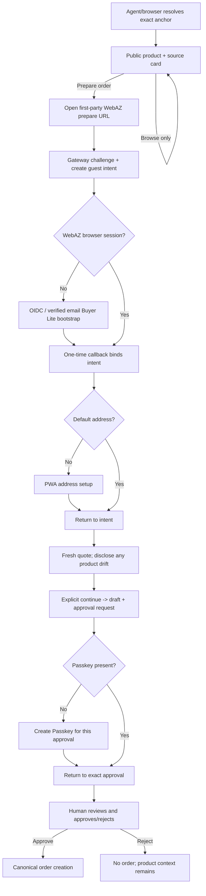

# RFC-028 — Guest Buyer Fast Entry / 未注册买家快速进入购物链路

**Status**: draft — audit and design only; no production behavior is changed
**Author**: WebAZ maintainers
**Created**: 2026-07-19
**Track**: buyer experience / agent commerce
**Security dependency**: [`AGENT-API-GATEWAY-THREAT-MODEL.md`](../audits/AGENT-API-GATEWAY-THREAT-MODEL.md)
**Related**: RFC-023, RFC-025, RFC-026, RFC-027

---

## 1. Decision summary

WebAZ will support this user journey without weakening the existing order or
Passkey boundary:

```text
public recommendation/product view
  -> explicit "prepare order"
  -> connect or create Buyer Lite
  -> restore the same product intent
  -> collect address inside WebAZ when needed
  -> fresh server quote
  -> immutable draft
  -> Passkey at approval time
  -> explicit approval
  -> canonical order creation
```

Browsing remains anonymous. No order, payment, address write, email, Passkey
challenge, quote, draft, or approval is created merely because an agent parsed
an anchor or showed a product.

This RFC does not make MCP OAuth a social-login protocol. WebAZ currently acts
as an OAuth authorization server for an **existing WebAZ user** delegating to
an agent. Buyer Lite identity bootstrap is a separate first-party identity
adapter (OIDC or verified email), after which the existing WebAZ OAuth grant
can be issued.

## 2. Evidence labels

| Label | Meaning |
|---|---|
| **Current fact** | Verified through the PR base `origin/main` at `6410671`. |
| **Decision** | Required target behavior; not yet implemented. |
| **Experiment** | Must be proved in tests or a host matrix before claiming support. |

## 3. Current-state audit

### 3.1 Registration and login

**Current fact.** `POST /api/register` exposes buyer and seller through one
route, requires verified email, name, role and region, applies Turnstile when
configured, and applies the global invitation switch. It also creates the
wallet, sponsor/placement records and an API key in the same registration
transaction ([`auth-register.ts`](../../src/pwa/routes/auth-register.ts#L103)).

Consequences:

- the ordinary buyer path is mixed with seller/referral placement concerns;
- `require_ref_to_register=1` blocks a buyer without an invite;
- there is no `Buyer Lite` account state;
- registration creates a simulated wallet and starts at 1000 WAZ even when the
  user only wants to buy;
- Google, Apple and OIDC subject binding are absent;
- password/API-key login exists, but magic-link login does not
  ([`auth-login.ts`](../../src/pwa/routes/auth-login.ts#L1)).

**Decision.** Public Buyer Lite bootstrap is invite-free and can never grant a
seller, recommender, contributor, verifier, arbitrator, governance or admin
capability. Seller and trusted-role onboarding remain separate.

Buyer Lite uses a dedicated buyer-only account initializer. It must not call the
ordinary `/api/register` writer or inherit its sponsor/placement tree, simulated
1000 WAZ wallet credit, seller role option, referral touches, API-key backup
modal or invitation requirement. It may establish the browser credential needed
by the current PWA only through the one-time back-channel handoff in section 3.2;
no credential is displayed, downloaded, placed in a URL or returned to an agent.
If a zero-balance wallet row is required by existing schema invariants, creating
that inert row is allowed; crediting it is not. User creation, subject binding
and the one-time browser handoff are transactional/idempotent so concurrent
callbacks for one verified subject converge on one buyer account.

### 3.2 Browser session and account relation

**Current fact.** The PWA authenticates with a WebAZ API key persisted in the
browser, and `user_sessions` records devices associated with that key. There is
no conventional first-party session cookie that an external identity provider
can attach to today. Current MCP OAuth access tokens resolve to an
`agent_delegation_grant`; they are not browser login sessions and they do not
replace the WebAZ account/API-key identity.

**Decision.** An external identity callback must never put an API key, access
token, guest-browser-session secret or magic-link secret in a URL. The
bootstrap adapter uses a one-time, short-lived server handoff and establishes
the existing WebAZ browser credential through a back-channel exchange. A later
session-cookie migration is optional and is not required by this RFC.

### 3.3 OAuth is delegation, not account creation

**Current fact.** WebAZ publishes OAuth discovery, DCR, Authorization Code +
PKCE and resource-bound opaque access tokens. `/oauth/approve` first calls the
normal WebAZ `auth()` and then requires a purpose-bound Passkey before creating
the delegation grant ([`oauth-approve.ts`](../../src/pwa/routes/oauth-approve.ts#L82)).

Therefore the current flow assumes all of the following already exist:

1. a WebAZ account;
2. a browser login credential;
3. a registered Passkey.

It cannot be the first Buyer Lite login. DCR also creates an explicitly
unverified, self-declared public client. Possession of its `client_id` is not
proof that the caller is ChatGPT, Claude, or any named agent
([`oauth-register.ts`](../../src/pwa/routes/oauth-register.ts#L1)).

**Decision.** Two flows remain separate:

- **identity bootstrap**: Google/Apple OIDC or verified email -> find/create
  Buyer Lite -> establish browser session;
- **agent delegation**: existing WebAZ user -> OAuth consent -> scoped grant.

The first may immediately lead into the second, but one protocol must not
pretend to be the other.

There is one required consent-policy change. The target journey cannot both
defer Passkey until final order approval and keep the current rule that every
OAuth consent requires an existing Passkey. The narrow resolution is:

- a verified Buyer Lite browser session may explicitly approve only an
  **intent-bound preparation grant** without a Passkey. It uses one new,
  explicitly narrow external OAuth scope, `purchase:prepare`; existing `read`,
  `order:draft` and `address` meanings remain unchanged and Passkey-consented;
- `purchase:prepare` is mutually exclusive with every other OAuth scope in a
  no-Passkey authorization request. A request that combines it with `read`,
  `order:draft`, `address` or any future scope fails with `invalid_scope`; a
  user who wants an ordinary broader grant completes the existing Passkey
  consent as a separate authorization transaction;
- that grant is bound to one `gpi`, client, resource, user, context hash,
  product, variant and quantity. Its object chain is monotonic: only the quote,
  draft and approval created from that intent become readable/actionable;
- its internal capability allowlist is limited to the exact public product and
  connection facts, an intent-bound quote, creation/read/cancel of that quote's
  draft, submission/read of that draft's pending approval, and no execution;
- it grants no wallet, profile, order-history, unrelated approval, address read,
  address-change, seller or governance capability. Missing/mismatched intent or
  object ancestry fails closed;
- the consent remains CSRF/state/PKCE/client/resource/scope/intent bound,
  short-lived, revocable and fully audited;
- address entry remains first-party PWA-only. A broader ordinary OAuth grant,
  including `address`, requires the existing Passkey consent or a separately
  reviewed future policy;
- the intent-bound `purchase:prepare` capability may quote, draft and submit one
  pending request, but cannot create an order or move funds;
- execution of the approval and every existing iron-rule action still requires
  a live purpose/payload-bound Passkey. The order-submit execution route must
  consume that gate token directly through the non-configurable
  `consumeGateToken` path; the protocol-param-toggleable
  `requireHumanPresence` wrapper is not sufficient for this economic action;
- every other OAuth scope/policy continues to use the current Passkey rule.

This is an explicit, separately reviewed security-policy PR. It must not be
implemented as a generic `skip_passkey` flag, a client-supplied option, or a
normal coarse grant with only a UI promise about the selected product.

### 3.4 Connection status

**Current fact.** `webaz_connection_status` calls the grant-only
`GET /api/agent-grants/connection`. A valid grant returns a handle, masked
account id, safe scopes and expiry; it never returns an API key, email or
address. No grant returns disconnected. This correctly describes the current
agent-to-WebAZ delegation, not whether a browser has a Buyer Lite account.

**Decision.** Keep this meaning. Add a separate browser bootstrap state; do not
overload `webaz_connection_status` with anonymous-intent or social-login state.

### 3.5 Public product and recommendation access

**Current fact.** Active product list, product detail and product preview are
public. Agent catalog browsing has query/limit guards, including a maximum of
eight records for unconstrained browsing ([`products-list.ts`](../../src/pwa/routes/products-list.ts#L108)).

**Current fact.** RFC-027 RA1 tables and lifecycle code exist, but
`src/recommendation-anchor.ts` is imported only by its test. Its header
explicitly says HTTP, MCP, search, quote and order cannot reach it. The old
`anchor_registry` resolver is a different, reclaimable first-touch attribution
system and must not be reused for Recommendation Anchors.

**Decision.** The guest flow depends on a later RFC-027 exact resolver. It must
resolve only the full `@namespace:code` grammar, return a minimal public
projection, and never fuzzy-match, list namespace contents or write attribution.

### 3.6 Quote, draft and approval

**Current fact.** Quote, draft and submit-request already form the correct
safe skeleton:

- quote requires a grant subject and a default address, computes current
  product/stock/region/shipping/direct-pay facts, and returns a 10-minute token;
- draft consumes one quote in a transaction and is immutable/cancellable;
- submit creates a pending approval only;
- Passkey approval revalidates and creates the real order exactly once.

Object reads are owner-scoped. Drafts contain only region and an address hash,
not a full address. These modules should be reused, not forked.

The MCP wrappers currently return a plain `GRANT_REQUIRED` when no credential
exists. They do not return a connection URL or preserved intent.

### 3.7 Address and Passkey

**Current fact.** WebAZ already has a 20-address address book, default-address
synchronization and masked agent reads. Full address entry is PWA-only.

**Current fact.** Passkey registration is authenticated and requires user
verification. A Passkey is optional at registration, but current OAuth consent
requires one. Registration success currently offers an immediate Passkey button
that removes `webaz_intended_hash` and routes to settings, so the original
purchase cannot resume automatically.

**Decision.** Buyer Lite does not create a Passkey during browsing or identity
bootstrap. The first order approval detects `NO_PASSKEY_REGISTERED`, opens a
purpose-specific Passkey setup route, then returns to that exact approval.

### 3.8 Existing return mechanism

**Current fact.** The PWA stores `webaz_intended_hash` in `sessionStorage` and
`navigateIntended()` consumes it after login. OAuth consent has a special
account-switch implementation using the same key. This is useful for a same-tab
login, but it is not a server-bound purchase intent, is not available across
devices/hosts, and has no ownership or replay lifecycle.

**Decision.** Preserve this as a UI convenience only. Server-side intent is the
authority. Every `return_to` is parsed against an internal route allowlist; an
external URL, protocol-relative URL, encoded scheme, userinfo, control
character or malformed hash is rejected.

## 4. Actual blockers

| Blocker | Owner | Reusable base | Database change? |
|---|---|---|---|
| No public Recommendation Anchor resolver | RFC-027 track | immutable RA1 tables | no for resolver |
| No persistent guest purchase intent | guest-buyer track | secure-id/idempotency patterns | yes |
| Buyer registration inherits invite/seller/referral workflow | identity track | users + verified email | yes/likely |
| No social OIDC or magic-link login | identity adapter | email delivery + OAuth primitives only | yes |
| Current MCP OAuth requires existing login + Passkey | protocol boundary | existing delegation grant | no semantic rewrite |
| SAFE preparation consent cannot precede Passkey | OAuth consent policy | submit-only order pipeline | no schema required; security policy change |
| Same-tab hash only; no server-bound return | guest-buyer track | `navigateIntended()` | yes |
| Address/Passkey setup does not resume purchase | buyer UI track | existing pages and APIs | no/possibly status field |
| Anchor provenance is absent from quote/draft/approval/order | RFC-027/guest integration | immutable purchase snapshots | yes |
| No independent multi-dimensional Agent/API gateway | security track | CF guard, grant verifier, IP limits | yes + infrastructure |

## 5. State model

### 5.1 User readiness (derived, not a competing role)

```text
Guest
  -> Buyer Lite        verified external subject or verified email; buyer only
  -> Buyer Addressed   active default address
  -> Buyer Ready       active default address + registered Passkey

Seller / Contributor / Governance are explicit upgrade flows, never implicit.
```

`Buyer Lite`, `Buyer Addressed` and `Buyer Ready` should be derived from account
facts rather than stored as another mutable role. A small immutable
`account_origin='buyer_lite_purchase'` audit field/event is sufficient for
onboarding analytics.

Payment-rail, product, inventory, region, shipping and seller eligibility are
fresh per-purchase facts evaluated at quote/create time. They are not cached in
the account-level `Buyer Ready` label.

### 5.2 Guest intent lifecycle

```text
issued -> bound -> completed
   |        |
   +------> expired
   +------> cancelled
```

- `issued`: created only by a challenged first-party human browser; no agent
  tool, anonymous or authorized, directly creates a guest browser session or
  `gpi` row.
- `bound`: CAS-bound to exactly one WebAZ buyer account.
- `bound` remains resumable. It may issue a fresh quote after expiry, price or
  stock drift, while downstream idempotency permits only one active
  draft/approval chain for the same economic intent.
- `completed`: the canonical order transaction linked the intent to exactly one
  order. Merely creating or expiring a quote/draft does not complete it.
- `expired/cancelled`: terminal.

Binding is idempotent for the same user and denied for every other user.
An issued intent has a short configurable TTL; successful identity binding may
extend it to a separate configurable onboarding TTL. Once an active draft or
approval exists, expiry of the discovery intent cannot invalidate that owned
downstream object. No TTL value is hard-coded in protocol semantics.

## 6. Page and host flow



For an agent host, an anonymous read returns a public product card and a
`prepare_url`. It does **not** create `gpi_*`. The user opens that URL; WebAZ's
first-party page creates the intent after edge/risk checks. This resolves the
conflict between zero-friction browsing and the rule that anonymous agents may
not create persistent transaction state.

### 6.1 Stateless preparation context and host resume

The public resolver returns a short-lived signed `pcx` preparation context in
the first-party URL. It contains only public, bounded fields:

```text
version, canonical anchor or product id, product id, variant id?, quantity,
ship-to region?, issued_at, expires_at, audience=webaz_prepare
```

`pcx` is an integrity envelope, not an account credential or authorization to
create an order. Minting it writes no transaction state. Opening it re-resolves
the anchor/product/variant, validates quantity/region, shows the exact context,
and only then runs the human-browser challenge before creating `gpi_*`.
It uses a versioned server-controlled algorithm and key id over canonical bytes;
the caller cannot select an algorithm, add fields or extend expiry. Its encoded
length and every field are bounded. Tampering, unknown key/version, wrong
audience or expiry fails uniformly without state creation.

The prepare response is `Cache-Control: no-store`, sets
`Referrer-Policy: no-referrer`, uses a restrictive CSP limited to the required
first-party resources, and loads no third-party pixels before consent.

Two continuations are supported without changing commerce semantics:

1. **PWA continuation:** after Buyer Lite bootstrap, bind the intent and proceed
   through address, fresh quote, draft and Passkey approval in WebAZ.
2. **Agent continuation:** the MCP OAuth challenge resumes a server-side
   authorization transaction after Buyer Lite bootstrap. WebAZ preserves the
   client's opaque OAuth `state`, PKCE, resource, redirect URI and requested
   SAFE scopes without parsing or rewriting them. After consent, the agent
   retries with the same public `pcx`; the authenticated grant resolves the
   exact originating OAuth authorization transaction, whose server-side record
   points to one intent and must also match the `pcx` context hash. WebAZ never
   guesses by user/product alone. The agent never receives `gpi_*` or the
   browser-session credential.

If a host cannot resume OAuth, the PWA continuation remains complete; the page
must say so honestly rather than claiming the external agent is connected.

## 7. Data model

### 7.1 `guest_purchase_intents`

Proposed additive table:

```text
id                       gpi_<128+ random bits>, primary key
guest_session_id         required, references guest_browser_sessions.id
source                   recommendation_anchor | product | search
recommendation_anchor_id nullable, server-resolved only
product_id               required
variant_id               nullable
quantity                 integer, bounded
ship_to_region           nullable public region only
desired_action           prepare_order
status                   issued | bound | completed | expired | cancelled
bound_user_id            nullable users.id
bound_at                  nullable
completed_order_id        nullable UNIQUE orders.id
completed_at              nullable
expires_at                required, short TTL
created_at                required
created_ip_hash           nullable abuse signal; no raw IP
created_client_id         nullable verified client reference
oauth_authorization_tx_id nullable UNIQUE server-side transaction reference
context_hash              canonical server hash of immutable source context
prepare_context_hash      hash of the validated signed pcx
```

Enforce at most one non-terminal intent for the same browser session and
preparation context with a partial unique index on
`(guest_session_id, prepare_context_hash) WHERE status IN ('issued','bound')`.
This makes duplicate tabs converge while allowing one browser to prepare
different products concurrently.

Security properties:

- `id` is a locator, never authorization by itself;
- the browser-session credential described below is the only pre-bind resume
  proof; the intent id remains a non-secret locator;
- initial bind requires the browser-session proof plus an authenticated buyer;
  every
  post-bind read/resume requires that same user's object ownership;
- anchor id is derived by resolving the canonical string; clients cannot post
  an arbitrary `ran_*`;
- product/variant relationship is checked at creation and rechecked at quote;
- one intent can bind to one account by CAS;
- an agent continuation resolves through the grant's exact server-side OAuth
  transaction link plus matching context hash, never a user/product search;
- completion and `completed_order_id` are written atomically with canonical
  order creation; quote/draft expiry leaves the bound intent resumable;
- no full address, payment credential, email, phone or private chat;
- no query-by-prefix/list endpoint;
- expired rows can be swept after an audit retention window.

### 7.2 `guest_browser_sessions`

One browser session may safely own multiple preparation intents:

```text
id                       gbs_<128+ random bits>, primary key
token_hash               SHA-256 of a separate 256-bit random bearer
created_at               required
last_seen_at             required
expires_at               required, bounded onboarding lifetime
revoked_at               nullable
```

The raw bearer is set only as a `Secure`, `HttpOnly`, host-only
`__Host-webaz-guest` cookie with `Path=/` and `SameSite=Lax`. It is never
returned in JSON, exposed to PWA JavaScript, placed in a URL, logged or copied
into analytics. `Lax` permits the top-level OIDC return while excluding normal
cross-site subrequests. State-changing first-party requests still require the
existing Origin/CSRF controls; `SameSite` is defense in depth, not the CSRF
authorization decision.

Opening the same valid `pcx` in duplicate tabs reuses the one active intent for
that session/context. Opening another product creates another intent linked to
the same session; no cookie is overwritten per intent. Revocation or expiry
invalidates pre-bind resume for every linked intent but does not invalidate an
already authenticated user's owned downstream draft, approval or order.

### 7.3 `guest_operation_capabilities`

The intent-bound OAuth grant does not expose a reusable account-wide writer.
Each non-executing state step uses a short-lived single-use capability:

```text
id                       goc_<128+ random bits>, primary key
token_hash               SHA-256 of separate 256-bit random bearer
guest_intent_id          required
oauth_grant_id           required
client_id                required
operation                exact endpoint/action enum
object_id                nullable expected parent object
canonical_payload_hash   required
status                   issued | consumed | expired | cancelled
expires_at               required
consumed_at              nullable
```

The first capability is issued only from the exact OAuth authorization
transaction linked to the intent; each successful step may mint only the next
allowlisted step. Consumption is CAS/idempotency protected. The raw bearer is
returned only to the authorized MCP client, never in a URL, browser page, log or
audit row. It cannot execute an approval/order and cannot be retargeted to a
different grant, client, intent, operation, object ancestry or payload. Because
OpenAI mTLS does not certificate-bind the OAuth token, theft of both unused
bearers still has a first-use race residual; short expiry, anomaly detection and
the final live Passkey remain required.

### 7.4 Identity subject binding

Use a separate table, not `users.handle` or email as the identity key:

```text
user_identity_subjects
  id
  user_id
  issuer                 exact normalized issuer
  provider               google | apple | email
  email_hint_hash        optional; not an authorization key
  verified_at
  created_at

user_identity_subject_aliases
  subject_id             references user_identity_subjects.id
  issuer                 exact normalized issuer
  subject_hmac           keyed HMAC of stable provider subject
  hmac_key_version       rotation identifier
  created_at
  UNIQUE(issuer, subject_hmac)
```

During HMAC-key rotation, lookup computes blind indexes with every accepted
current/previous key version. A match keeps the stable subject row and
transactionally adds the current-version alias; it never overwrites the old
alias. Old keys remain lookup-only until every binding has a current alias.
For a first-seen subject, insert the binding and current alias in one transaction;
a concurrent unique-alias conflict loses, discards its provisional binding and
loads the winner. This additive alias model prevents one provider subject from
creating a second account merely because the HMAC key version changed.

The callback links an existing user only through an authenticated account-link
flow or a unique previously verified issuer/subject. A Google/Apple/OIDC email
claim, including `email_verified=true`, never silently links to an existing
WebAZ account. If that email is already present, the user must authenticate the
existing WebAZ account or re-prove control through WebAZ's own verified-email
flow and explicitly confirm linking; otherwise bootstrap stops or creates a
separate non-conflicting account according to the identity policy. The stable
authorization key remains issuer + subject, never display name or email alone.

### 7.5 Return state

OIDC `state` points to a short-lived server record containing the intent id,
validated preparation-context hash, PKCE/nonce binding, internal route id,
expected issuer and, when present, the external OAuth authorization transaction
reference. The raw browser-session proof remains only in the HttpOnly cookie.
The record and callback are one-time CAS-consumed. The callback never accepts a
free-form `return_to`, redirect URI or anchor id.

### 7.6 `buyer_lite_handoffs`

The OIDC callback does not place a WebAZ API key in its redirect. It creates one
short-lived handoff record:

```text
id                       blh_<128+ random bits>, non-secret locator
guest_session_id         required
oidc_transaction_id      required UNIQUE
user_id                  required
internal_route_id        allowlisted
status                   pending | consumed | expired
expires_at               required
consumed_at              nullable
```

The handoff is redeemable only from the originating guest-browser session with
the existing Origin/CSRF checks. `blh_*` may identify the internal return page
but is not authorization without the HttpOnly session proof. Redemption uses a
single `pending -> consumed` CAS and delivers the current PWA browser credential
once over a no-store same-origin response; the credential is never put in a URL,
log, audit row, analytics event or agent response. A copied callback, an
attacker-prestarted login, wrong browser session, expiry or concurrent second
redemption fails without relinking the account. A lost redemption response does
not create another account or commerce object; the user restarts the verified
login/handoff to establish a new browser credential.

### 7.7 Recommendation provenance

The same immutable `recommendation_anchor_id` is copied separately from
economic hashes through:

```text
guest intent -> quote -> draft -> approval summary/hash -> order provenance
```

It cannot alter amount, inventory, payment rail, ranking or commission. A user
who explicitly changes product clears the active anchor unless a different
valid anchor is explicitly resolved and confirmed.

The integrity claim begins at the first-party human confirmation, not at text an
external agent previously displayed. The prepare page and final approval show
the recommender handle and canonical anchor. Replacing anchor A with another
valid anchor B, even for the same product, invalidates the prior confirmation
and requires an explicit new confirmation; a context hash alone cannot prove
what an external host showed before WebAZ opened.

## 8. Agent/API Security Gateway dependency

No G1 state-creating endpoint may be mounted directly on the current public
route surface. It must pass the gateway policy described in the threat model.
The required principal distinction is:

- `anonymous_agent`: public exact reads only;
- `registered_agent`: verified client/transport provenance, public reads only;
- `user_authorized_agent`: verified provenance where available + valid user
  grant + route risk policy + object/capability scope;
- `verified_partner_agent`: true sender-constrained registered profile and
  higher quota only, never weaker authorization;
- `human_browser_guest`: first-party browser risk context, not an asserted
  identity; may create a bounded guest intent after challenge.

Unverified DCR clients remain `anonymous_agent`. User-Agent, model name, Host,
custom headers and conversation text never raise trust. Proof is negotiated per
registered client, not hard-coded to one vendor: ChatGPT's documented minimum
profile is OpenAI-managed mTLS + OAuth, while DPoP/request signatures/partner
mTLS may serve other clients. CIMD + `private_key_jwt` strengthens ChatGPT's
token exchange but does not replace proof on the MCP resource connection.

Because Cloudflare terminates TLS, production elevation requires a positive
staging experiment proving that the edge validates OpenAI's published CA chain
and required SAN and creates an internal, non-spoofable gateway principal. If
the active Cloudflare plan cannot import the OpenAI CA, WebAZ must use a
dedicated trusted TLS terminator or keep the client low-tier; it must not trust
a forwarded client-certificate header supplied by the caller.

## 9. Progressive authorization

The existing coarse OAuth scopes keep their meanings. Add only the narrow
`purchase:prepare` scope for this flow; fine capabilities and intent/object
constraints remain internal mappings. A no-Passkey `purchase:prepare` request
must contain exactly that one scope. Mixed requests fail `invalid_scope`; they
must never inherit the no-Passkey exception for ordinary scopes.

Recommended phases:

| Phase | Coarse OAuth request | Fine capabilities |
|---|---|---|
| Buyer Lite prepare | `purchase:prepare` | intent-bound public/connection facts, quote, draft, submit and only this chain's approval read |
| Address | no agent scope in Buyer Lite flow | first-party PWA entry; broader `address` remains Passkey-consented |
| Private order view | later, only when needed | minimal buyer order read |

Do not request seller or governance scopes. Do not trigger one consent dialog
per API call; consent once for the immediate purchase stage. The displayed
scope never overrides the intent/object restriction in section 3.3.

## 10. Error contract

Unauthenticated agent purchase preparation returns a structured host response,
not an actionable persistent intent:

```json
{
  "code": "ACCOUNT_CONNECTION_REQUIRED",
  "message": "Connect a WebAZ buyer account to continue. No order will be placed.",
  "prepare_url": "https://webaz.xyz/prepare?pcx=<signed-public-context>",
  "preserved_public_context": {
    "product_id": "prd_xxx",
    "quantity": 1,
    "ship_to_region": "SG",
    "canonical_anchor": "@tina:ha95k"
  },
  "next_action": "open_prepare_url"
}
```

Only after the user opens the first-party URL and passes risk controls may the
server establish its HttpOnly guest-browser session and create or reuse the
matching intent. PWA JavaScript and the agent receive neither `intent_id` nor
the browser-session credential before binding.

Authenticated missing-address and missing-Passkey responses may contain an
absolute WebAZ setup URL bound to the owned intent/approval. They must not
contain address data or a reusable Passkey challenge.

## 11. PR sequence

Security PRs are prerequisites, not optional polish:

| PR | Scope | Production reachability |
|---|---|---|
| **S0** | threat model, asset/current-control audit, acceptance matrix | docs only |
| **S1** | principal/client registry; proof negotiation; OpenAI mTLS/CIMD experiments; DPoP/signature seam and replay cache | fail-closed, feature flag off |
| **S2** | distributed multi-dimensional limits, cost budgets, circuit breakers | guards existing/new agent API |
| **S3** | registration/anchor/quote/draft/approval abuse policy | policy off until tested |
| **S4** | edge/WAF/origin/degraded-mode runbook and application switch | operationally gated |
| **S5** | abuse tests, dashboards, alerts, incident runbook | no commerce semantics |

Feature PRs then remain narrow:

| PR | Scope | Depends on |
|---|---|---|
| **G1** | signed stateless prepare context + guest-browser-session and guest-intent schema/domain/bind/resume/expiry; no UI auto-order | S1/S2 minimum gateway landing + RFC-027 resolver |
| **G2** | Buyer Lite identity bootstrap and buyer invite exemption | S2/S3 |
| **G3** | allowlisted return/deep-link and one-time browser handoff recovery | G1/G2 |
| **G4** | anchor provenance through quote/draft/approval/order, still unreachable | RFC-027 + G1–G3 |
| **G5** | address completion -> fresh quote resume | G3/G4 |
| **G6** | first-purchase Passkey -> exact approval resume; order-submit execution consumes the purpose/payload-bound token directly, without a protocol-param bypass | G5 |

Do not combine S1 with G1 or G2. Security primitives require independent
review and rollback.

S1/S2 are sufficient only to land unreachable/default-off G1 code. No public
state-creating route or Buyer Lite bootstrap may be enabled until S3 abuse
policy, S4 edge/origin/degraded-mode controls and S5 adversarial/operational
gates are complete and the activation checklist passes.

A single server-owned production-reachability predicate mirrors that complete
checklist and fails closed; a feature-flag value alone cannot bypass it. The
predicate includes positive canonical-host and negative direct-origin probes.
Recommendation-anchor preparation remains unreachable until G4 provenance is
present through quote, draft, approval and order. Generic product preparation
may not silently drop an anchor supplied in its signed context.

G2 is internally split for reviewability:

- **G2a**: dedicated buyer-only account initializer + subject model + reuse of
  the existing verified-email challenge primitive, with no reuse of the
  ordinary-registration writer or its economic/referral side effects;
- **G2b**: Google OIDC adapter;
- **G2c**: Apple OIDC adapter;
- **G2d**: narrow intent-bound preparation grant + operation-capability chain
  described in sections 3.3 and 7.3.

Email verification is the shortest first usable path; it must not be described
as OAuth. Google and Apple use the same issuer/subject adapter and cannot fork
account-creation semantics.

## 12. Minimal funnel analytics

Record only the minimum internal events needed to locate user friction:

```text
anchor_resolved
product_viewed
prepare_order_clicked
account_connect_started
account_connect_completed
address_required
address_completed
quote_created
draft_created
approval_opened
order_created
```

Each event uses an internal request/intent/subject reference and coarse result
code. It does not contain a full address, provider token, Passkey material,
private chat or a recommender-visible buyer identity. An active source context
is cleared when the user explicitly changes product. Analytics cannot create
attribution or alter commerce state.

## 13. Acceptance tests

In addition to the requested ten user journeys, every implementation must prove:

1. no anonymous MCP can create quote/draft/approval state, and no MCP agent
   tool can directly create a guest browser session or `gpi` row;
2. unverified DCR `client_id` does not raise trust;
3. forged User-Agent/model/header does not raise trust;
4. changing `ran_*`, product, variant or return route is rejected;
5. intent id without the originating guest-browser-session proof cannot
   bind/read private state;
6. intent bound to user A cannot be bound or completed by B;
7. OAuth state, nonce, authorization code and callback record are one-time;
   the guest-browser session is expiring/revocable and cannot bind without its
   HttpOnly proof;
8. another user's `qte`, `odr`, `apr` or `ord` is never readable by id swap;
9. no full address/token/challenge appears in response, URL, log or audit row;
10. duplicate tabs converge on one binding, one draft and one active approval;
11. product drift forces a visible reconfirmation;
12. degraded mode preserves approval/status/reconcile reads, refuses an
    unclaimed execution without consuming it, pauses its expiry, and lets an
    already claimed execution finish or enter reconcile;
13. anchor miss and disabled/unknown responses resist enumeration;
14. malicious product content is data, never an instruction channel;
15. every unknown-outcome write has a read/reconcile path;
16. signed `pcx` preserves exact anchor/product/variant/quantity/region and
    rejects tamper, wrong audience and expiry without creating state;
17. guest-browser-session proof never appears in URL, JSON, DOM, JavaScript
    storage, logs or analytics;
18. quote expiry or visible product drift permits a fresh quote from the same
    bound intent but never creates a second active draft/approval;
19. both PWA continuation and OAuth agent retry resolve the same owned context
    without exposing an intent id to the agent;
20. Buyer Lite creation produces no sponsor/placement/referral touch, simulated
    wallet credit, seller capability or ordinary registration modal;
21. duplicate tabs for one `pcx` reuse one active intent while different `pcx`
    values in the same browser can coexist without overwriting session proof;
22. HMAC-key rotation finds an existing issuer/subject through any accepted
    alias and adds the current alias without deleting the old one; concurrent
    first use or rotation cannot create a duplicate account;
23. two simultaneous callbacks for one verified subject create one Buyer Lite
    account, no credited wallet and no referral/placement records;
24. an agent retry resolves only the intent linked to its own OAuth authorization
    transaction and matching context hash, even when the user prepared the same
    product in another browser;
25. the prepare page is no-store, no-referrer and CSP-restricted, and an unknown
    context key/version or oversized encoding creates no state;
26. Buyer Lite `purchase:prepare` cannot read wallet/profile/order history,
    request an address change, quote another product or access another intent's
    draft/approval;
27. each operation capability is single-use and rejects wrong grant, client,
    intent, endpoint, object ancestry or payload hash; final execution remains
    unreachable without Passkey;
28. replacing valid anchor A with valid anchor B for the same product visibly
    invalidates confirmation and requires a fresh human confirmation;
29. copied callback, login-CSRF/prestarted login, wrong browser session and
    concurrent handoff redemption do not deliver a browser credential or relink
    an account;
30. pending-before-claim, claimed, committed and unknown-outcome approvals each
    follow the explicit degraded-mode behavior without double execution.
31. `purchase:prepare` alone may enter the narrow no-Passkey consent, while any
    request mixing it with `read`, `order:draft`, `address` or another scope
    fails `invalid_scope`; disabling any generic human-presence protocol param
    still cannot execute an order without a valid purpose/payload-bound Passkey.

## 14. Rollback

- Every new route is feature-flagged off by default.
- G1 tables are additive; disabling routes makes them inert. Do not drop rows during
  rollback because active callbacks may still reference them.
- G2 identity subjects are additive. Rollback disables new bootstrap but
  preserves already-created buyer accounts and subject links.
- G3/G5/G6 are UI/orchestration changes; old login/address/Passkey pages remain.
- G4 provenance columns are nullable and forward-only. Existing orders remain
  valid.
- Gateway denial or overload can enter `read_only_degraded_mode`; it must never
  roll back or delete an order/approval already committed. Before an execution
  claim it leaves the approval pending/retryable and pauses its expiry; after a
  claim it permits atomic completion or `needs_reconcile`, including reconcile
  reads and recovery writes.

## 15. Non-goals

- no automatic purchase;
- no address exposure to an agent;
- no commission settlement from Recommendation Anchors;
- no seller/governance auto-upgrade;
- no trust based on brand strings or User-Agent;
- no vendor-specific WebAZ protocol behavior;
- no replacement of the canonical quote/draft/approval/order engines.
