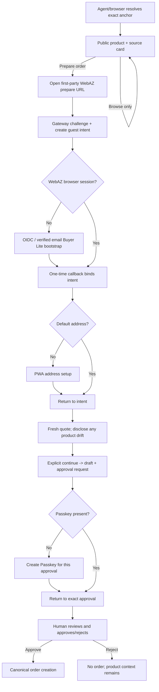

# RFC-028 — Guest Buyer Fast Entry / 未注册买家快速进入购物链路

**Status**: draft — audit and design only; no production behavior is changed
**Author**: WebAZ maintainers
**Created**: 2026-07-19
**Track**: buyer experience / agent commerce
**Security dependency**: [`AGENT-API-GATEWAY-THREAT-MODEL.md`](../audits/AGENT-API-GATEWAY-THREAT-MODEL.md)
**Related**: RFC-023, RFC-025, RFC-026, RFC-027

---

## 1. Decision summary

WebAZ will support this user journey without weakening the existing order or
Passkey boundary:

```text
public recommendation/product view
  -> explicit "prepare order"
  -> connect or create Buyer Lite
  -> restore the same product intent
  -> collect address inside WebAZ when needed
  -> fresh server quote
  -> immutable draft
  -> Passkey at approval time
  -> explicit approval
  -> canonical order creation
```

Browsing remains anonymous. No order, payment, address write, email, Passkey
challenge, quote, draft, or approval is created merely because an agent parsed
an anchor or showed a product.

This RFC does not make MCP OAuth a social-login protocol. WebAZ currently acts
as an OAuth authorization server for an **existing WebAZ user** delegating to
an agent. Buyer Lite identity bootstrap is a separate first-party identity
adapter (OIDC or verified email), after which the existing WebAZ OAuth grant
can be issued.

## 2. Evidence labels

| Label | Meaning |
|---|---|
| **Current fact** | Verified in `origin/main` at `74ca33f`. |
| **Decision** | Required target behavior; not yet implemented. |
| **Experiment** | Must be proved in tests or a host matrix before claiming support. |

## 3. Current-state audit

### 3.1 Registration and login

**Current fact.** `POST /api/register` exposes buyer and seller through one
route, requires verified email, name, role and region, applies Turnstile when
configured, and applies the global invitation switch. It also creates the
wallet, sponsor/placement records and an API key in the same registration
transaction ([`auth-register.ts`](../../src/pwa/routes/auth-register.ts#L103)).

Consequences:

- the ordinary buyer path is mixed with seller/referral placement concerns;
- `require_ref_to_register=1` blocks a buyer without an invite;
- there is no `Buyer Lite` account state;
- registration creates a simulated wallet and starts at 1000 WAZ even when the
  user only wants to buy;
- Google, Apple and OIDC subject binding are absent;
- password/API-key login exists, but magic-link login does not
  ([`auth-login.ts`](../../src/pwa/routes/auth-login.ts#L1)).

**Decision.** Public Buyer Lite bootstrap is invite-free and can never grant a
seller, recommender, contributor, verifier, arbitrator, governance or admin
capability. Seller and trusted-role onboarding remain separate.

### 3.2 Browser session and account relation

**Current fact.** The PWA authenticates with a WebAZ API key persisted in the
browser, and `user_sessions` records devices associated with that key. There is
no conventional first-party session cookie that an external identity provider
can attach to today. Current MCP OAuth access tokens resolve to an
`agent_delegation_grant`; they are not browser login sessions and they do not
replace the WebAZ account/API-key identity.

**Decision.** An external identity callback must never put an API key, access
token, guest resume token or magic-link secret in a URL. The bootstrap adapter
uses a one-time, short-lived server handoff and establishes the existing WebAZ
browser credential through a back-channel exchange. A later session-cookie
migration is optional and is not required by this RFC.

### 3.3 OAuth is delegation, not account creation

**Current fact.** WebAZ publishes OAuth discovery, DCR, Authorization Code +
PKCE and resource-bound opaque access tokens. `/oauth/approve` first calls the
normal WebAZ `auth()` and then requires a purpose-bound Passkey before creating
the delegation grant ([`oauth-approve.ts`](../../src/pwa/routes/oauth-approve.ts#L82)).

Therefore the current flow assumes all of the following already exist:

1. a WebAZ account;
2. a browser login credential;
3. a registered Passkey.

It cannot be the first Buyer Lite login. DCR also creates an explicitly
unverified, self-declared public client. Possession of its `client_id` is not
proof that the caller is ChatGPT, Claude, or any named agent
([`oauth-register.ts`](../../src/pwa/routes/oauth-register.ts#L1)).

**Decision.** Two flows remain separate:

- **identity bootstrap**: Google/Apple OIDC or verified email -> find/create
  Buyer Lite -> establish browser session;
- **agent delegation**: existing WebAZ user -> OAuth consent -> scoped grant.

The first may immediately lead into the second, but one protocol must not
pretend to be the other.

There is one required consent-policy change. The target journey cannot both
defer Passkey until final order approval and keep the current rule that every
OAuth consent requires an existing Passkey. The narrow resolution is:

- a verified Buyer Lite browser session may explicitly approve only the
  non-executing SAFE purchase-preparation scopes (`read`, `order:draft` and,
  when needed, `address`) without a Passkey;
- the consent remains CSRF/state/PKCE/client/resource/scope bound, short-lived,
  revocable and fully audited;
- `order:draft` may quote, draft and submit a pending request, but cannot create
  an order or move funds;
- execution of the approval and every existing iron-rule action still requires
  a live purpose/payload-bound Passkey;
- every other OAuth scope/policy continues to use the current Passkey rule.

This is an explicit, separately reviewed security-policy PR. It must not be
implemented as a generic `skip_passkey` flag or a client-supplied option.

### 3.4 Connection status

**Current fact.** `webaz_connection_status` calls the grant-only
`GET /api/agent-grants/connection`. A valid grant returns a handle, masked
account id, safe scopes and expiry; it never returns an API key, email or
address. No grant returns disconnected. This correctly describes the current
agent-to-WebAZ delegation, not whether a browser has a Buyer Lite account.

**Decision.** Keep this meaning. Add a separate browser bootstrap state; do not
overload `webaz_connection_status` with anonymous-intent or social-login state.

### 3.5 Public product and recommendation access

**Current fact.** Active product list, product detail and product preview are
public. Agent catalog browsing has query/limit guards, including a maximum of
eight records for unconstrained browsing ([`products-list.ts`](../../src/pwa/routes/products-list.ts#L108)).

**Current fact.** RFC-027 RA1 tables and lifecycle code exist, but
`src/recommendation-anchor.ts` is imported only by its test. Its header
explicitly says HTTP, MCP, search, quote and order cannot reach it. The old
`anchor_registry` resolver is a different, reclaimable first-touch attribution
system and must not be reused for Recommendation Anchors.

**Decision.** The guest flow depends on a later RFC-027 exact resolver. It must
resolve only the full `@namespace:code` grammar, return a minimal public
projection, and never fuzzy-match, list namespace contents or write attribution.

### 3.6 Quote, draft and approval

**Current fact.** Quote, draft and submit-request already form the correct
safe skeleton:

- quote requires a grant subject and a default address, computes current
  product/stock/region/shipping/direct-pay facts, and returns a 10-minute token;
- draft consumes one quote in a transaction and is immutable/cancellable;
- submit creates a pending approval only;
- Passkey approval revalidates and creates the real order exactly once.

Object reads are owner-scoped. Drafts contain only region and an address hash,
not a full address. These modules should be reused, not forked.

The MCP wrappers currently return a plain `GRANT_REQUIRED` when no credential
exists. They do not return a connection URL or preserved intent.

### 3.7 Address and Passkey

**Current fact.** WebAZ already has a 20-address address book, default-address
synchronization and masked agent reads. Full address entry is PWA-only.

**Current fact.** Passkey registration is authenticated and requires user
verification. A Passkey is optional at registration, but current OAuth consent
requires one. Registration success currently offers an immediate Passkey button
that removes `webaz_intended_hash` and routes to settings, so the original
purchase cannot resume automatically.

**Decision.** Buyer Lite does not create a Passkey during browsing or identity
bootstrap. The first order approval detects `NO_PASSKEY_REGISTERED`, opens a
purpose-specific Passkey setup route, then returns to that exact approval.

### 3.8 Existing return mechanism

**Current fact.** The PWA stores `webaz_intended_hash` in `sessionStorage` and
`navigateIntended()` consumes it after login. OAuth consent has a special
account-switch implementation using the same key. This is useful for a same-tab
login, but it is not a server-bound purchase intent, is not available across
devices/hosts, and has no ownership or replay lifecycle.

**Decision.** Preserve this as a UI convenience only. Server-side intent is the
authority. Every `return_to` is parsed against an internal route allowlist; an
external URL, protocol-relative URL, encoded scheme, userinfo, control
character or malformed hash is rejected.

## 4. Actual blockers

| Blocker | Owner | Reusable base | Database change? |
|---|---|---|---|
| No public Recommendation Anchor resolver | RFC-027 track | immutable RA1 tables | no for resolver |
| No persistent guest purchase intent | guest-buyer track | secure-id/idempotency patterns | yes |
| Buyer registration inherits invite/seller/referral workflow | identity track | users + verified email | yes/likely |
| No social OIDC or magic-link login | identity adapter | email delivery + OAuth primitives only | yes |
| Current MCP OAuth requires existing login + Passkey | protocol boundary | existing delegation grant | no semantic rewrite |
| SAFE preparation consent cannot precede Passkey | OAuth consent policy | submit-only order pipeline | no schema required; security policy change |
| Same-tab hash only; no server-bound return | guest-buyer track | `navigateIntended()` | yes |
| Address/Passkey setup does not resume purchase | buyer UI track | existing pages and APIs | no/possibly status field |
| Anchor provenance is absent from quote/draft/approval/order | RFC-027/guest integration | immutable purchase snapshots | yes |
| No independent multi-dimensional Agent/API gateway | security track | CF guard, grant verifier, IP limits | yes + infrastructure |

## 5. State model

### 5.1 User readiness (derived, not a competing role)

```text
Guest
  -> Buyer Lite        verified external subject or verified email; buyer only
  -> Buyer Addressed   active default address
  -> Buyer Ready       address + Passkey + required payment-rail readiness

Seller / Contributor / Governance are explicit upgrade flows, never implicit.
```

`Buyer Lite`, `Buyer Addressed` and `Buyer Ready` should be derived from account
facts rather than stored as another mutable role. A small immutable
`account_origin='buyer_lite_purchase'` audit field/event is sufficient for
onboarding analytics.

### 5.2 Guest intent lifecycle

```text
issued -> bound -> consumed
   |        |         |
   +------> expired <-+
   +------> cancelled
```

- `issued`: created only by a challenged first-party human browser or an
  already user-authorized agent; never by an anonymous agent tool call.
- `bound`: CAS-bound to exactly one WebAZ buyer account.
- `consumed`: context was carried into the first authoritative quote/draft
  continuation. It does not mean an order was created.
- `expired/cancelled`: terminal.

Binding is idempotent for the same user and denied for every other user.

## 6. Page and host flow



For an agent host, an anonymous read returns a public product card and a
`prepare_url`. It does **not** create `gpi_*`. The user opens that URL; WebAZ's
first-party page creates the intent after edge/risk checks. This resolves the
conflict between zero-friction browsing and the rule that anonymous agents may
not create persistent transaction state.

## 7. Data model

### 7.1 `guest_purchase_intents`

Proposed additive table:

```text
id                       gpi_<128+ random bits>, primary key
resume_token_hash        SHA-256 of separate 256-bit resume bearer
source                   recommendation_anchor | product | search
recommendation_anchor_id nullable, server-resolved only
product_id               required
variant_id               nullable
quantity                 integer, bounded
ship_to_region           nullable public region only
desired_action           prepare_order
status                   issued | bound | consumed | expired | cancelled
bound_user_id            nullable users.id
bound_at                  nullable
consumed_at               nullable
expires_at                required, short TTL
created_at                required
created_ip_hash           nullable abuse signal; no raw IP
created_client_id         nullable verified client reference
context_hash              canonical server hash of immutable source context
```

Security properties:

- `id` is a locator, never authorization by itself;
- the raw resume token is returned once and never stored;
- bind/consume requires resume proof **and** authenticated object ownership;
- anchor id is derived by resolving the canonical string; clients cannot post
  an arbitrary `ran_*`;
- product/variant relationship is checked at creation and rechecked at quote;
- one intent can bind to one account by CAS;
- no full address, payment credential, email, phone or private chat;
- no query-by-prefix/list endpoint;
- expired rows can be swept after an audit retention window.

### 7.2 Identity subject binding

Use a separate table, not `users.handle` or email as the identity key:

```text
user_identity_subjects
  id
  user_id
  issuer                 exact normalized issuer
  subject_hash           hash/HMAC of stable provider subject
  provider               google | apple | email
  email_hint_hash        optional; not an authorization key
  verified_at
  created_at
  UNIQUE(issuer, subject_hash)
```

The callback links an existing user only through an authenticated account-link
flow or a unique previously verified subject. Matching solely by an email claim
is forbidden unless provider semantics and verification are explicitly checked.

### 7.3 Return state

OIDC `state` points to a short-lived server record containing the intent id,
resume proof hash, PKCE/nonce binding, internal route id and expected issuer.
The callback never accepts a free-form `return_to` or anchor id.

### 7.4 Recommendation provenance

The same immutable `recommendation_anchor_id` is copied separately from
economic hashes through:

```text
guest intent -> quote -> draft -> approval summary/hash -> order provenance
```

It cannot alter amount, inventory, payment rail, ranking or commission. A user
who explicitly changes product clears the active anchor unless a different
valid anchor is explicitly resolved.

## 8. Agent/API Security Gateway dependency

No G1 state-creating endpoint may be mounted directly on the current public
route surface. It must pass the gateway policy described in the threat model.
The required principal distinction is:

- `anonymous_agent`: public exact reads only;
- `registered_agent`: verified cryptographic client identity, public reads only;
- `user_authorized_agent`: verified per-connection client proof + valid user
  grant + object scope;
- `verified_partner_agent`: higher quota only, never weaker authorization;
- `human_browser_guest`: first-party browser risk context, not an asserted
  identity; may create a bounded guest intent after challenge.

Unverified DCR clients remain `anonymous_agent`. User-Agent, model name, Host,
custom headers and conversation text never raise trust. Proof is negotiated per
registered client, not hard-coded to one vendor: ChatGPT's documented minimum
profile is OpenAI-managed mTLS + OAuth, while DPoP/request signatures/partner
mTLS may serve other clients. CIMD + `private_key_jwt` strengthens ChatGPT's
token exchange but does not replace proof on the MCP resource connection.

Because Cloudflare terminates TLS, production elevation requires a positive
staging experiment proving that the edge validates OpenAI's published CA chain
and required SAN and creates an internal, non-spoofable gateway principal. If
the active Cloudflare plan cannot import the OpenAI CA, WebAZ must use a
dedicated trusted TLS terminator or keep the client low-tier; it must not trust
a forwarded client-certificate header supplied by the caller.

## 9. Progressive authorization

The existing coarse OAuth scopes remain the external protocol surface. Fine
capabilities remain internal mappings.

Recommended phases:

| Phase | Coarse OAuth request | Fine capabilities |
|---|---|---|
| Connect/read | `read` | public/profile/discovery + approval read |
| Prepare purchase | `order:draft` | price quote, draft, submit request |
| Address | `address` | masked read + change request |
| Private order view | later, only when needed | minimal buyer order read |

Do not request seller or governance scopes. Do not trigger one consent dialog
per API call; consent once for the immediate purchase stage.

## 10. Error contract

Unauthenticated agent purchase preparation returns a structured host response,
not an actionable persistent intent:

```json
{
  "code": "ACCOUNT_CONNECTION_REQUIRED",
  "message": "Connect a WebAZ buyer account to continue. No order will be placed.",
  "prepare_url": "https://webaz.xyz/prepare/tina/ha95k",
  "preserved_public_context": {
    "product_id": "prd_xxx",
    "quantity": 1,
    "ship_to_region": "SG",
    "canonical_anchor": "@tina:ha95k"
  },
  "next_action": "open_prepare_url"
}
```

Only after the user opens the first-party URL and passes risk controls may the
PWA receive `intent_id` and a resume secret.

Authenticated missing-address and missing-Passkey responses may contain an
absolute WebAZ setup URL bound to the owned intent/approval. They must not
contain address data or a reusable Passkey challenge.

## 11. PR sequence

Security PRs are prerequisites, not optional polish:

| PR | Scope | Production reachability |
|---|---|---|
| **S0** | threat model, asset/current-control audit, acceptance matrix | docs only |
| **S1** | principal/client registry; proof negotiation; OpenAI mTLS/CIMD experiments; DPoP/signature seam and replay cache | fail-closed, feature flag off |
| **S2** | distributed multi-dimensional limits, cost budgets, circuit breakers | guards existing/new agent API |
| **S3** | registration/anchor/quote/draft/approval abuse policy | policy off until tested |
| **S4** | edge/WAF/origin/degraded-mode runbook and application switch | operationally gated |
| **S5** | abuse tests, dashboards, alerts, incident runbook | no commerce semantics |

Feature PRs then remain narrow:

| PR | Scope | Depends on |
|---|---|---|
| **G1** | guest-intent schema/domain/bind/expiry; no UI auto-order | S1/S2 minimum gateway landing + RFC-027 resolver |
| **G2** | Buyer Lite identity bootstrap and buyer invite exemption | S2/S3 |
| **G3** | allowlisted return/deep-link recovery | G1/G2 |
| **G4** | address completion -> fresh quote resume | G3 |
| **G5** | first-purchase Passkey -> exact approval resume | G4 |
| **G6** | anchor provenance through quote/draft/approval/order | RFC-027 + G1–G5 |

Do not combine S1 with G1 or G2. Security primitives require independent
review and rollback.

G2 is internally split for reviewability:

- **G2a**: Buyer Lite account/subject model + existing verified-email bootstrap;
- **G2b**: Google OIDC adapter;
- **G2c**: Apple OIDC adapter;
- **G2d**: narrow SAFE preparation-consent policy described in section 3.3.

Email verification is the shortest first usable path; it must not be described
as OAuth. Google and Apple use the same issuer/subject adapter and cannot fork
account-creation semantics.

## 12. Minimal funnel analytics

Record only the minimum internal events needed to locate user friction:

```text
anchor_resolved
product_viewed
prepare_order_clicked
account_connect_started
account_connect_completed
address_required
address_completed
quote_created
draft_created
approval_opened
order_created
```

Each event uses an internal request/intent/subject reference and coarse result
code. It does not contain a full address, provider token, Passkey material,
private chat or a recommender-visible buyer identity. An active source context
is cleared when the user explicitly changes product. Analytics cannot create
attribution or alter commerce state.

## 13. Acceptance tests

In addition to the requested ten user journeys, every implementation must prove:

1. anonymous MCP cannot create `gpi`, quote, draft or approval rows;
2. unverified DCR `client_id` does not raise trust;
3. forged User-Agent/model/header does not raise trust;
4. changing `ran_*`, product, variant or return route is rejected;
5. intent id without resume proof cannot bind/read private state;
6. intent bound to user A cannot be bound or consumed by B;
7. OAuth state/nonce/PKCE and intent resume tokens are one-time and expiring;
8. another user's `qte`, `odr`, `apr` or `ord` is never readable by id swap;
9. no full address/token/challenge appears in response, URL, log or audit row;
10. duplicate tabs converge on one binding, one draft and one active approval;
11. product drift forces a visible reconfirmation;
12. degraded mode preserves existing order/approval reads and blocks new costly state;
13. anchor miss and disabled/unknown responses resist enumeration;
14. malicious product content is data, never an instruction channel;
15. every unknown-outcome write has a read/reconcile path.

## 14. Rollback

- Every new route is feature-flagged off by default.
- G1 table is additive; disabling routes makes it inert. Do not drop rows during
  rollback because active callbacks may still reference them.
- G2 identity subjects are additive. Rollback disables new bootstrap but
  preserves already-created buyer accounts and subject links.
- G3–G5 are UI/orchestration changes; old login/address/Passkey pages remain.
- G6 columns are nullable and forward-only. Existing orders remain valid.
- Gateway denial or overload can enter `read_only_degraded_mode`; it must never
  roll back or delete an order/approval already committed.

## 15. Non-goals

- no automatic purchase;
- no address exposure to an agent;
- no commission settlement from Recommendation Anchors;
- no seller/governance auto-upgrade;
- no trust based on brand strings or User-Agent;
- no vendor-specific WebAZ protocol behavior;
- no replacement of the canonical quote/draft/approval/order engines.
